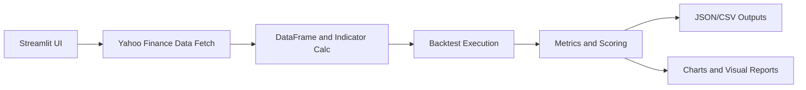

# kabucomtrading

株式データの可視化とバックテスト検証を行う Python アプリです。

- 主な用途: Yahoo Finance データを使ったチャート確認と戦略検証
- 推奨 UI: Streamlit
- 補助機能: 複数銘柄比較、ウォークフォワード分析、詳細メトリクス

## このアプリを理解する最短ルート

「何をするアプリか分からない」場合は、まず次の順で見るのが早いです。

1. Streamlit 画面を起動してチャートを触る
2. 出力される JSON/CSV を確認する
3. 必要になったらバックテスト系スクリプトを読む

## 3分クイックスタート

### 1) 依存インストール

```bash
uv sync
```

または

```bash
pip install -e .
```

### 2) Streamlit 起動

```bash
uv run streamlit run streamlit_app.py
```

Windows venv を直接使う場合:

```powershell
.\.venv\Scripts\python.exe -m streamlit run streamlit_app.py
```

起動後にブラウザで http://localhost:8501 を開きます。

## Streamlitの起動方法

プロジェクト直下で以下を実行します。

```powershell
uv run streamlit run streamlit_app.py
```

venvのPythonを直接使う場合:

```powershell
.\.venv\Scripts\python.exe -m streamlit run streamlit_app.py
```

起動後:

- URL: `http://localhost:8501`
- 停止: ターミナルで `Ctrl + C`

## 使い方（基本）

初めて使う場合は、次の手順で進めると全体像を把握しやすいです。

1. Streamlitを起動する
2. 「チャート」タブで対象銘柄の値動きを確認する
3. 「バックテスト」タブで戦略・パラメータを設定して実行する
4. 生成された評価指標と結果ファイルを確認する

### 1) Streamlitを起動する

```powershell
uv run streamlit run streamlit_app.py
```

起動後に `http://localhost:8501` を開きます。

### 2) チャートを確認する

- 銘柄コード（例: `7203`）を入力
- 期間（例: `365`日）と時間軸（例: `1d`）を選択
- ローソク足と指標を見て、相場の傾向を把握

### 3) バックテストを実行する

- 戦略を選択（EMA / RSI / MACD など）
- 必要に応じてパラメータを調整
- バックテストを実行し、結果を確認

### 4) 結果を評価する

特に次の3指標を優先して確認します。

- `total_profit`（総損益）
- `max_drawdown`（最大ドローダウン）
- `robust_score`（リスク調整済み総合スコア）

結果ファイルは主に次へ保存されます。

- `results/backtest_results.json`
- `results/backtest_details/`
- `results/backtest_rankings/`

### 5) さらに深掘りする（任意）

- コードで戦略を試す: `uv run streamlit run strategy_lab.py`
- 複数銘柄で比較検証: `uv run python multi_stock_backtest.py`
- 将来データリークを避けた検証: `uv run python walkforward_analysis.py`

## Strategy Lab（コードで戦略を書く）

TradingView（PineScript）風にコードで戦略を書いてバックテストできる画面です。

### 起動

```powershell
uv run streamlit run strategy_lab.py
```

- URL: `http://localhost:8501`
- 停止: ターミナルで `Ctrl + C`

### 使い方

1. サイドバーで銘柄・時間軸・期間を設定（例: 7203, 1d, 365）
2. テンプレート（EMAクロス / RSI逆張り / ボリンジャーバンド）を読み込む
3. エディタでコードを編集
4. 「バックテスト実行」を押す
5. チャート・ストラテジーテスター・エクイティカーブ・トレード一覧を確認

### 最適化の使い方（グリッドサーチ）

1. サイドバーの「最適化」で目的関数を選択
2. 「パラメータ範囲」に探索範囲を記述
3. 「最大試行数」を設定
4. 「最適化を実行」を押す
5. ベスト設定の結果チャートとランキング表を確認

### ディレクトリごとの動作内容

- app/backtest/: バックテストの中核処理です。シグナルを受けて売買シミュレーションを実行し、損益指標を計算し、結果可視化とトレードログ出力を行います。
- app/controllers/: レガシー側の制御層です。Web API 応答、ストリーミング受信、AI 補助処理の入口を担います。
- app/models/: データモデル層です。ローソク足テーブル操作、イベント記録、データ変換の基盤ロジックを提供します。
- app/services/: リクエストに応じた指標設定など、コントローラから切り出した共通処理を担います。
- app/strategy/: Strategy Lab と CLI 実行で使う戦略実行基盤です。戦略コードの実行、指標計算、最適化ユーティリティを提供します。
- app/views/: Flask 側で返却する HTML テンプレートを配置します。
- data/: 入力データ群の保管領域です。市場別/業種別の補助データを置く用途です。
- docs/: 運用ドキュメントです。バックテスト手順や DB セットアップ手順を参照します。
- kabucom/: kabusapi 連携の実装です。実売買系・価格取得系の接続処理を持ちます。
- oanda/: OANDA 連携の実装です。FX 系の接続・注文関連処理を持ちます。
- results/: 実行結果の出力先です。詳細結果 CSV、ランキング CSV、ウォークフォワード結果 JSON、キャッシュを保存します。
- scripts/: バッチ/CLI の実体です。銘柄データ取り込み、テーブル準備、戦略実行、複数銘柄検証、ウォークフォワード分析を行います。
- strategies/: Strategy Lab や CLI から読み込む戦略サンプルです。関数定義ベースで売買ロジックを記述します。
- templates/: 取り込みや初期化時に使うテンプレートファイルを配置します。
- tests/: ユニットテスト群です。戦略実行、指標計算、最適化、リスク管理の回帰を検証します。
- tradingalgo/: テクニカル計算の補助アルゴリズムを提供します。
- utils/: 設定変換やシリアライズなど汎用ユーティリティです。

### ルート主要ファイルの動作内容

- streamlit_app.py: メイン UI です。チャート表示、バックテスト実行、結果表示の操作フローを提供します。
- strategy_lab.py: コード戦略 UI です。戦略編集、バックテスト、パラメータ最適化を対話的に実行します。
- enhanced_backtest.py / backtest_metrics.py / backtest_visualizer.py / trade_logger.py: 互換ラッパーです。既存 import を維持しつつ実体を app/backtest/ に委譲します。
- multi_stock_backtest.py / walkforward_analysis.py / run_strategy.py / import_yahoo_to_db.py / prepare_candle_table.py: 互換ラッパーです。既存 CLI パスを維持しつつ実体を scripts/ に委譲します。
- README.md: 利用手順、構成、運用上の参照情報をまとめたドキュメントです。


パラメータ範囲の例:

```text
fast=5:30:5
slow=20:80:10
rsi_low=20,25,30
```

- `start:end:step` 形式または `a,b,c` 形式で指定できます。
- 試行数が多いほど時間がかかるため、まずは `50~100` 程度がおすすめです。

指数（日経平均）は銘柄コード `^N225`、市場サフィックスを空欄にします。

### コードの書き方（PineScript風API）

```python
def strategy(ctx, params):
    ta = ctx.ta
    fast_len = int(params.get("fast", 12))
    slow_len = int(params.get("slow", 26))

    fast = ta.ema(ctx.close, fast_len)
    slow = ta.ema(ctx.close, slow_len)

    ctx.plot(fast, title="EMA12")
    ctx.plot(slow, title="EMA26")

    if ta.crossover(fast, slow):
        ctx.strategy.entry("long", ctx.strategy.long)
    elif ta.crossunder(fast, slow):
        ctx.strategy.close("long")
```

`def strategy(ctx):` 形式も引き続き利用できます。

利用できる主なAPI:

- 価格系列: `ctx.close` / `ctx.open` / `ctx.high` / `ctx.low` / `ctx.volume`
- 指標: `ctx.ta.ema` / `ta.sma` / `ta.rsi` / `ta.macd` / `ta.bbands` / `ta.atr`
- TA-Lib全関数: `ctx.ta.EMA(...)` / `ctx.ta.ADX(...)` / `ctx.ta.ATR(...)` のように直接呼び出し可能
- クロス: `ctx.ta.crossover(a, b)` / `ctx.ta.crossunder(a, b)`
- 注文: `ctx.strategy.entry("id", ctx.strategy.long)` / `ctx.strategy.close("id")`
- 描画: `ctx.plot(series, title="EMA12")`
- 状態: `ctx.position`（0=無, 1=ロング, -1=ショート）

補足:

- 利用可能な TA-Lib 関数一覧は `ctx.ta.functions()` で取得できます。

### コマンドラインで実行する

```powershell
uv run python run_strategy.py --file strategies/ema_cross.py --code 7203 --days 365 --duration 1d
```

日経平均の例:

```powershell
uv run python run_strategy.py --file strategies/rsi_reversal.py --code '^N225' --days 365 --duration 1d --market ""
```

### 3) まず触るべきタブ

- チャート: 銘柄、期間、時間軸を変えて挙動確認
- 比較: 複数銘柄を同期間で比較
- バックテスト: 戦略の結果を確認

## 主要ファイル早見表

## ディレクトリ構成

```text
kabucomtrading/
├── app/                        # アプリ実装本体
│   ├── backtest/               # バックテスト実行・評価・可視化
│   ├── strategy/               # Strategy Lab 実行基盤
│   ├── models/                 # DB/データモデル
│   ├── services/               # 共通サービス
│   ├── controllers/            # レガシーWeb/API制御
│   └── views/                  # Flaskテンプレート
├── scripts/                    # CLI/バッチ実体
├── strategies/                 # 戦略サンプル
├── tests/                      # ユニットテスト
├── docs/                       # 運用ドキュメント
├── results/                    # 実行結果（JSON/CSV/キャッシュ）
├── data/                       # 補助データ
├── templates/                  # 取り込みテンプレート
├── kabucom/                    # kabusapi連携
├── oanda/                      # OANDA連携
├── tradingalgo/                # テクニカル補助アルゴリズム
├── utils/                      # 汎用ユーティリティ
├── streamlit_app.py            # メインUI
├── strategy_lab.py             # コード戦略UI
└── README.md
```

### 互換ラッパー（ルート直下）

既存の import/CLI パスを壊さないため、以下は実装本体へ委譲する薄いラッパーです。

- `enhanced_backtest.py` -> `app/backtest/enhanced_backtest.py`
- `backtest_metrics.py` -> `app/backtest/backtest_metrics.py`
- `backtest_visualizer.py` -> `app/backtest/backtest_visualizer.py`
- `trade_logger.py` -> `app/backtest/trade_logger.py`
- `multi_stock_backtest.py` -> `scripts/multi_stock_backtest.py`
- `walkforward_analysis.py` -> `scripts/walkforward_analysis.py`
- `run_strategy.py` -> `scripts/run_strategy.py`
- `import_yahoo_to_db.py` -> `scripts/import_yahoo_to_db.py`
- `prepare_candle_table.py` -> `scripts/prepare_candle_table.py`

### まずここだけ読めばOK

- `streamlit_app.py`: 画面と操作フロー
- `strategy_lab.py`: コードで戦略を書くTradingView風の画面
- `docs/BACKTEST_GUIDE.md`: バックテスト系機能の説明
- `settings.ini`: 初期設定

### バックテスト関連

- `backtest_metrics.py`: シャープレシオ、ドローダウンなど評価指標
- `backtest_visualizer.py`: バックテスト結果の可視化
- `trade_logger.py`: 取引ログ保存（CSV/JSON）
- `enhanced_backtest.py`: リスク管理付きバックテスト
- `walkforward_analysis.py`: ウォークフォワード分析
- `multi_stock_backtest.py`: 複数銘柄をまとめて検証

### Strategy Lab（コード戦略）

- `run_strategy.py`: 戦略ファイルをバックテストするCLI
- `strategies/`: 戦略サンプル（ema_cross.py, rsi_reversal.py）
- `app/strategy/`: 戦略エンジン（context / engine / indicators）

### 既存システム（レガシー/実売買側）

- `main.py`: エントリーポイント
- `app/controllers/`: Web/API/ストリーム処理
- `app/services/`: 共通ロジック層（パラメータ解析など）
- `app/models/`: Candle と指標計算
- `kabucom/kabucom.py`: kabusapi クライアント

## 何ができるか

- Yahoo Finance データ取得
- ローソク足とテクニカル指標の可視化
- 戦略バックテスト結果の保存
- リスク管理付きバックテスト（コスト・スリッページ対応）
- 複数銘柄ランキング
- ウォークフォワード分析

## 全体フロー（ざっくり）



見方:

1. 左から右に、操作から結果生成までの流れです
2. 出力は JSON/CSV と可視化の2系統です
3. 詳細分析はこの出力を使って行います

## バックテスト結果の見方

最低限、次の3つを見ると判断しやすくなります。

1. `total_profit`（総損益）
2. `max_drawdown`（最大ドローダウン）
3. `robust_score`（リスク調整済み総合スコア）

目安:

- 総損益だけ高く、ドローダウンが大きい戦略は要注意
- `robust_score` は「利益と安定性のバランス」を見るための補助指標

## 推奨の使い方（実務的）

1. Streamlit のチャートで対象銘柄の癖を掴む
2. バックテストで候補パラメータを絞る
3. ウォークフォワードで過学習を確認
4. 複数銘柄で再検証し、特定銘柄依存を避ける

## 現在のリポジトリ状態に関する注意

このワークスペースでは `backtest_yahoo.py` が見当たりません。

- `streamlit_app.py` のバックテスト実行処理
- `multi_stock_backtest.py`

は `backtest_yahoo` モジュールを参照しています。これらを使う場合は、`backtest_yahoo.py` を用意するか、参照先を既存実装に差し替えてください。

## 設定

`settings.ini` で主に以下を調整します。

- `product_code`: 銘柄コード
- `trade_duration`: 時間軸（例: 1m / 1h / 1d）
- `past_period`: 取得期間（日数）
- `back_test`: バックテストモード

`[paths]` セクションで出力先を統一管理できます。

- `results_dir`: 出力ルート
- `backtest_results_file`: 単一バックテスト結果 JSON
- `multi_stock_results_file`: 複数銘柄結果 JSON
- `backtest_details_dir`: 詳細 CSV 保存先
- `backtest_rankings_dir`: ランキング CSV 保存先
- `walkforward_dir`: ウォークフォワード JSON 保存先
- `cache_dir`: Streamlit キャッシュ保存先

## DBへデータを入れる

Yahoo Finance の価格データを SQLite に保存できます。

### 1) インポート実行

```bash
uv run python import_yahoo_to_db.py --code 7203 --days 365 --duration 1d --market T
```

### 2) 保存先DB

- DBファイル: `stockdata.sql`（`settings.ini` の `db.name`）
- テーブル名: `CANDLE_<銘柄コード>_<時間軸>`

例:

- `--code 7203 --duration 1d` の場合は `CANDLE_7203_1D`

### 3) 補足

- 既存時刻データは主キー制約で重複保存されません
- `5s` 指定時は Yahoo 側制約により `1m` データで代用されます

## HeidiSQLからデータ投入する

HeidiSQLで直接DBへ入れる場合は、まず投入先テーブルを作成します。

```bash
uv run python prepare_candle_table.py --code 7203 --duration 1d
```

その後、HeidiSQLで `stockdata.sql` に接続し、
`CANDLE_7203_1D` のようなテーブルへ手入力またはCSVインポートで追加できます。

詳しい手順は以下を参照してください。

- `docs/HEIDISQL_SETUP.md`
- `templates/heidisql_candle_template.csv`（CSV投入テンプレート）

## よくあるハマりどころ

### TA-Lib が入らない

OS ごとの事前ライブラリ導入が必要です。

- Windows: TA-Lib バイナリを導入後に Python パッケージをインストール
- macOS: `brew install ta-lib`
- Linux: `apt-get install ta-lib`

### Streamlit は開くがバックテストが動かない

`backtest_yahoo.py` の有無を確認してください。

### データが想定より少ない

Yahoo Finance の時間軸ごとの取得上限に依存します。

## プロジェクト構成（概要）

```text
kabucomtrading/
├─ streamlit_app.py
├─ enhanced_backtest.py
├─ backtest_metrics.py
├─ backtest_visualizer.py
├─ trade_logger.py
├─ walkforward_analysis.py
├─ multi_stock_backtest.py
├─ docs/
│  └─ BACKTEST_GUIDE.md
├─ results/
│  ├─ backtest_results.json
│  ├─ multi_stock_backtest_results.json
│  ├─ backtest_details/
│  ├─ backtest_rankings/
│  ├─ walkforward/
│  └─ cache/
├─ archive/
├─ settings.ini
└─ app/
   ├─ controllers/
   ├─ services/
   ├─ models/
   └─ data/
```

## 免責

本プロジェクトは検証・学習用途を含みます。実運用での損益については自己責任で判断してください。